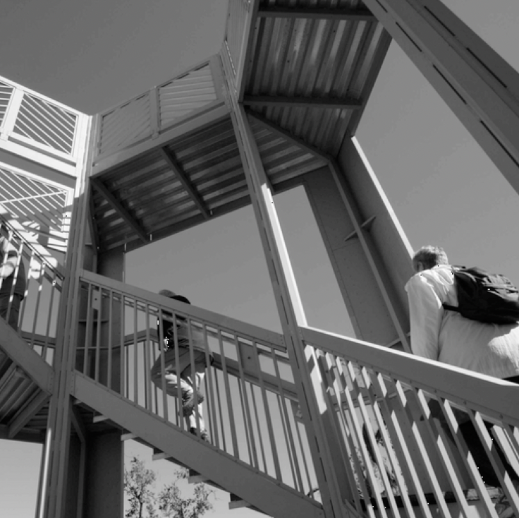

# Computer Vision Model

## Fashion MNIST Dataset

Created a simple deep neural network for computer vision. Trained to recognize a piece of clothing from the Fashion MNIST Dataset. 
Note: In this model, the clothing item has to be the only thing on the picture and it has to be centered.
Accuracy:
Test Data: 83% ; Training Data: 87%

## Convolutions And Pooling

* Created a feature map of an image from the from misc in SciPy.
    
* The first filter gives emphasis to the vertical lines of the picture.
    

* The second filter provides emphasis to the horizontal lines of the picture.
    

* Pooling is done using Maximum Pooling. Information from the picture is reduced (in terms of pixels) while maintaining the features that are detected.
    

## Enhance Computer Vision Using Convolutions

Enhanced Computer Vision for the MNIST Fashion Dataset using a Convolution Matrix.
Accuracy:
Test Data: 91% ; Training Data: 99%
